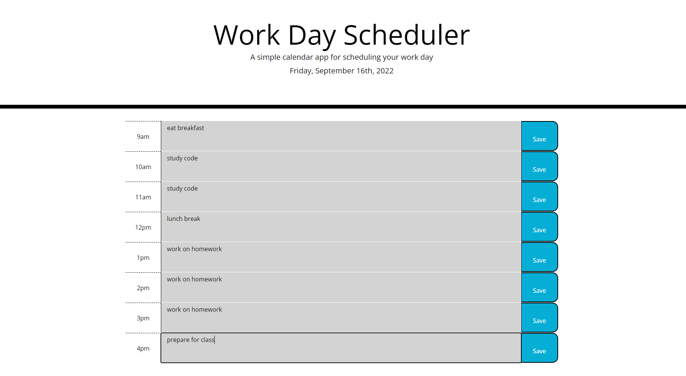

# Challenge 5: Work Day Scheduler

## Description

In this challenge I was instructed to build a daily work-day planner. The application I built displays displays the current date at the top and each time slot displays a different color based on the current time of day. The user can select a time slot and enter in a to-do, then by clicking 'save' they can save it to local storage. Saving their to-dos to local storage allows them to be able to view their tasks even after the page is refreshed. Completing this challenge helped me better understand jQuery, Bootstrap, and Moment.js features as well as how to handle using local storage.

## Image

## Link to Deployed Website

<a href="https://pinkywiththebrain.github.io/scheduler-challenge-5/">Work Day Planner</a>